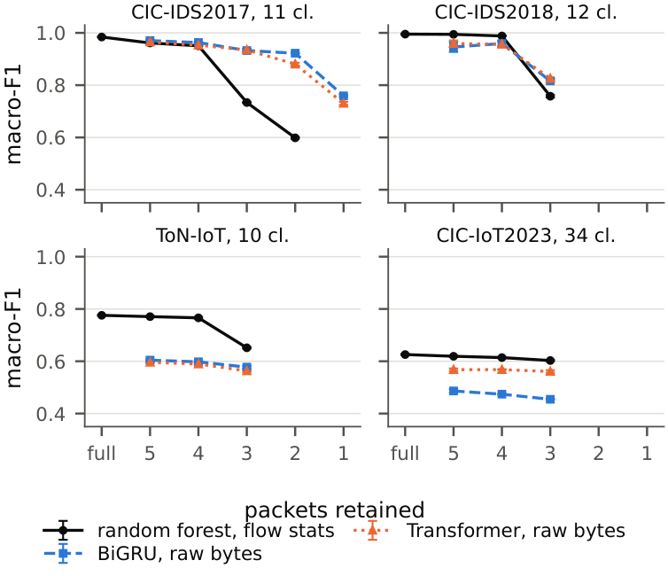
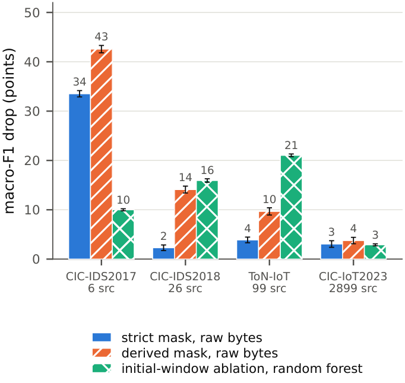

# Shortcut Learning in Early Intrusion Detection

[](#citation)


[](LICENSE)

Code and aggregate results for the paper **"Shortcut Learning in Early Intrusion
Detection: Header Fingerprints Across Four Datasets"** (IEEE TPS 2026), by
Michele Guida, Stefano Iannucci, Raj Patel, Shahram Rahimi, Sudip Mittal and
Paolo Merialdo (Roma Tre University and The University of Alabama).

How early can a network intrusion be detected, and what is the model actually
looking at when it succeeds? We classify flows from their first 5, 4, 3, 2 or 1
packets on four public datasets, with two pipelines, and then remove header
fields one at a time to see what the score was resting on.

<p align="center">
  
  
</p>

## Findings at a glance

- **Flow statistics hold until the handshake.** On CIC-IDS2017 a random forest
  keeps a macro-F1 of 0.95 with four packets and falls to 0.73 with three, when
  application-level evidence is no longer observed.
- **Raw bytes look more robust, until header fields are masked.** At three
  packets the byte models score 0.93 with addresses and ports masked, and 0.60
  once IP and TCP options are also zeroed.
- **The same probes, four testbeds.** Removing the two initial-TCP-window
  features at three packets costs 10, 16, 21 and 3 macro-F1 points on
  CIC-IDS2017, CIC-IDS2018, ToN-IoT and CIC-IoT2023.
- **Source composition matters.** The effects shrink as attack classes are
  spread over more sources: 6, 26, 99 and 2,899 attack-source addresses.

These are within-dataset measurements. Generalization to unseen hosts and tools
is not tested here.

## Quick start

Regenerate every figure and table of the paper from the included results, with
no dataset and no GPU:

```bash
conda env create -f environment.yml && conda activate earlynids
python figures/make_figures.py
python seed_runs/make_tables.py figures/results.json
```

This repository contains the flow-feature and raw-byte pipelines, the masking
policies, the byte-region occlusion sweep, and the five-seed harness that
generated the reported means and standard deviations. The datasets are not
redistributed; `scripts/*/download.py` fetches them from their official sources,
which require you to register under your own details.

## What the paper reports

Four public testbeds, two representations, packet cutoffs from the complete flow
down to a single packet:

| key | dataset | flows | classes |
|---|---|---|---|
| `cic_ids2017` | CIC-IDS2017 | 2.09 M | 11 |
| `cic_ids2018` | CIC-IDS2018 | 2.62 M | 12 |
| `toniot` | ToN-IoT | 8.36 M | 10 |
| `cic_iot2023` | CIC-IoT2023 | 2.40 M | 34 |

Every configuration is run five times with seeds 42, 1, 2, 3, 4. The seed drives
both the data partition and the initialization, so two configurations sharing a
seed are compared on the same split and differences are reported as paired.

## Layout

```
scripts/common/       occlusion sweep and the derived-mask generator
scripts/<dataset>/    download, flow reconstruction, byte extraction, training
src/<dataset>/        labeling, flow pipelines, model definitions, data loading
seed_runs/            the five-seed harness: manifests, queue, aggregation, tables
figures/              results.json and the script that draws the four figures
tables/exclusion/     label-matching exclusion rates by flow length and by class
```

`figures/results.json` is the aggregate this study reports: 109 configurations,
16 occlusion sweeps, 24 paired differences, five seeds each. It is included so
the tables and figures can be regenerated without rerunning the experiments.

## Environment

```bash
conda env create -f environment.yml     # creates the "earlynids" environment
conda activate earlynids
```

`requirements.txt` lists the same dependencies for a plain virtualenv. Training
needs one CUDA GPU; the random-forest fits are CPU-only. The reported runs used
a single H200 with 16 CPU cores and 125 GB of RAM.

## Reproducing without retraining

```bash
python figures/make_figures.py          # the four figures, from figures/results.json
python seed_runs/make_tables.py figures/results.json      # the four tables, as LaTeX
```

`make_tables.py` looks every cell up by key and prints `MISSING` rather than a
plausible value when a key is absent, so a partial `results.json` is visible as
such instead of quietly producing a wrong table.

## Reproducing from the datasets

Set the repository root once. Every script derives its paths from it, and from
its own location when the variable is unset:

```bash
export EARLYNIDS_ROOT="$PWD"
```

**1. Fetch the data.** Each portal has its own registration flow; the scripts
document what each one needs.

```bash
python scripts/cic_ids2017/download.py     # needs $CIC_SESSION_COOKIE
python scripts/toniot/download.py
python scripts/cic_iot2023/download.py     # needs the $CIC_REG_* registration vars
```

**2. Reconstruct flows and extract the first 256 bytes** of each retained packet,
starting at the IP header. Per dataset, for example on CIC-IDS2017:

```bash
python scripts/cic_ids2017/extract_packets.py
python scripts/cic_ids2017/build_partial_flows.py
python scripts/cic_ids2017/build_packet_abs_cut.py --max-pkts 5
python scripts/cic_ids2017/extract_raw_bytes.py --max-pkts 5 --n-bytes 256
```

**3. Build the masked variants.** The basic mask zeroes the eight address and
four port bytes; the strict mask follows the published policy; the derived masks
zero the occlusion-ordered regions cumulatively.

```bash
python scripts/common/derive_masks.py --dataset cic_ids2017 --max-pkts 5
```

**4. Run the five-seed grid.** `gen_jobs.py` writes three manifests, one job per
line as `id <TAB> donefile <TAB> command`:

```bash
python seed_runs/gen_jobs.py             # jobs_byte.tsv, jobs_rf.tsv, jobs_occl.tsv
bash seed_runs/run_queue2.sh jobs_byte.tsv 3
bash seed_runs/run_queue2.sh jobs_rf.tsv 3
bash seed_runs/run_queue2.sh jobs_occl.tsv 3
```

`run_job.sh` skips jobs whose done-file exists, so the queue is restartable, and
admits a job only when enough memory is actually free. The memory floors in that
file are sized for a 125 GB machine and for the ToN-IoT trainer, which holds
about 21 GB while it builds tensors for 8.36 M flows; adjust `FLOOR_BIG`,
`FLOOR_SMALL` and the per-kind `NEED` values to your hardware. The occlusion
manifest reads models the byte manifest trains, so run it last.

**5. Aggregate and emit.**

```bash
python seed_runs/collect_seeds.py        # writes seed_runs/results.json; copy it to figures/
python seed_runs/make_tables.py figures/results.json
python figures/make_figures.py
```

## Notes on the measurements

Occlusion is measured on a frozen model: a region is zeroed at inference and the
macro-F1 drop is recorded against the same model's unoccluded score on the same
split. Masking is measured by retraining from scratch, because a feature that is
removed before training is not the same intervention as one hidden afterwards.

Attribution on a single frozen model is less stable than the paired differences
between retrained models. Where the five seeds disagree on which region is most
affected, the tables report the vote as a fraction, and a tie is printed as both
names rather than resolved silently.

## Citation

```bibtex
@inproceedings{guida2026shortcut,
  author    = {Guida, Michele and Iannucci, Stefano and Patel, Raj and Rahimi, Shahram and Mittal, Sudip and Merialdo, Paolo},
  title     = {Shortcut Learning in Early Intrusion Detection: Header Fingerprints Across Four Datasets},
  booktitle = {IEEE International Conference on Trust, Privacy and Security in Intelligent Systems, and Applications (TPS)},
  year      = {2026}
}
```

## License

The code is released under the [MIT License](LICENSE). The datasets are not part
of this repository and remain under the terms of their providers.
